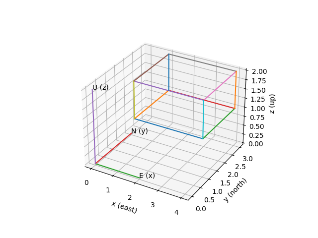

# PVCollada Coordinate Transformation Guide

## ENU Coordinate Frame

PVCollada uses a local **East‑North‑Up (ENU)** coordinate system:

- **x** → East  
- **y** → North  
- **z** → Up  

The origin `(0,0,0)` corresponds to the latitude and longitude stored in the COLLADA document.

## Example Geometry

Cube definition:

- lower corner `(1,1,1)`
- size `(3,2,1)`

Origin location:

- Albuquerque, NM, USA  
- Latitude `35.0845`  
- Longitude `-106.651`  
- Projection `EPSG:32613`

## Diagram



The diagram shows the cube in the local coordinate system along with the ENU axes.

## Computed Geographic Coordinates

| x | y | z | latitude | longitude | height |
|---|---|---|---|---|---|
| 1 | 1 | 1 | 35.08450916 | -106.65098922 | 1 |
| 4 | 1 | 1 | 35.08450961 | -106.65095632 | 1 |
| 1 | 3 | 1 | 35.08452719 | -106.65098958 | 1 |
| 4 | 3 | 1 | 35.08452764 | -106.65095668 | 1 |
| 1 | 1 | 2 | 35.08450916 | -106.65098922 | 2 |
| 4 | 1 | 2 | 35.08450961 | -106.65095632 | 2 |
| 1 | 3 | 2 | 35.08452719 | -106.65098958 | 2 |
| 4 | 3 | 2 | 35.08452764 | -106.65095668 | 2 |

## Python Example

```python
from pyproj import Transformer

lat0 = 35.0845
lon0 = -106.651

transformer_to_utm = Transformer.from_crs("EPSG:4326","EPSG:32613",always_xy=True)
transformer_to_wgs = Transformer.from_crs("EPSG:32613","EPSG:4326",always_xy=True)

E0,N0 = transformer_to_utm.transform(lon0,lat0)

x,y,z = 1,1,1

E = E0 + x
N = N0 + y

lon,lat = transformer_to_wgs.transform(E,N)

print(lat,lon)
```
